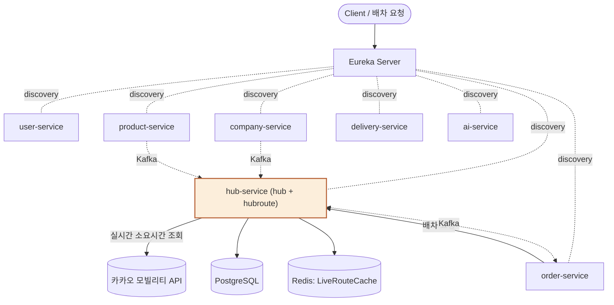
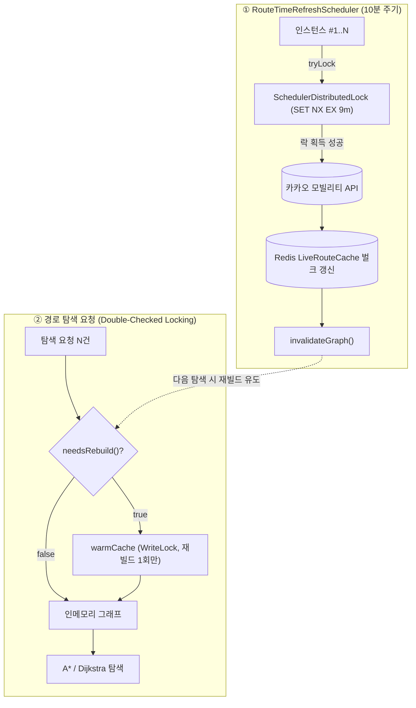

# 🚚 hub-service (APANG)


> **APANG** 플랫폼의 **허브(Hub) 마스터 관리**와 **허브 간 최적 배송 경로 탐색**을 담당하는 마이크로서비스입니다.

APANG은 여러 허브(물류 거점)를 거쳐 상품을 배송하는 MSA 기반 허브 라우팅 물류 플랫폼입니다. hub-service는 허브 자체의 등록·관리(hub)와 허브 간 최적 배송 경로 탐색(hubroute)이라는 두 개의 논리적 컨텍스트(Bounded Context)를 하나의 프로세스 안에서 함께 제공합니다.

---

## 📖 Core Domain

* **Hub (hub 컨텍스트, 애그리게이트 루트):** 허브의 이름·주소·담당자(HubManager)·보관 상품(HubProduct)을 관리합니다. MASTER 권한 사용자만 생성·수정·삭제할 수 있습니다.
* **HubRoute (hubroute 컨텍스트):** 두 허브를 잇는 구간(간선)으로, 기본 소요시간/거리(DB 정적값)와 실시간 소요시간(Redis, 카카오 모빌리티 API 기반)을 함께 가집니다.

---

## 🏗️ Architecture

APANG은 Eureka 기반 디스커버리 위에서 동작하는 마이크로서비스로 구성되며, hub-service는 order-service의 배차 요청 시 최적 경로를 계산해 응답하고, Kafka로 허브 변경 이벤트를 발행합니다.



*주황색 = 담당 서비스(hub-service)*

---

## ✨ Key Features & Technical Decisions

### 1. 허브 간 최적 경로 탐색 — A* / Dijkstra
출발 허브에서 도착 허브까지의 최적 배송 경로를 하나의 탐색 로직(`OptimalRouteCalculator`)에서 A*(유클리드 휴리스틱 기반)와 Dijkstra(h=0인 A*의 특수 케이스) 두 알고리즘으로 계산할 수 있으며, API 호출 시 알고리즘을 선택할 수 있습니다. 휴리스틱은 두 허브 간 평면 유클리드 직선거리를 허브 간 최대 이동 속도(90km/h)로 나눈 값으로, 실제 소요시간이 항상 이 값 이상이 되도록 보수적으로 설계해 A*가 항상 최적 경로를 반환하도록(admissibility) 보장합니다. k6 벤치마크 결과 그래프 규모가 커질수록(허브 11개 → 500개) A*의 탐색 노드 절감률이 25% → 41%로 커지는 것을 정량적으로 확인했습니다.

### 2. 인메모리 그래프 캐시 + 이중 검증 락킹
경로 탐색용 인접 리스트와 허브 좌표를 인메모리 그래프로 캐싱해 탐색 중에는 순수 메모리 연산만 발생하도록 합니다. 캐시 재빌드는 `ReentrantReadWriteLock` 기반 이중 검증 락킹으로 감싸, 트래픽이 폭주해도 실제 재빌드는 단 1회만 수행되도록 동시성을 통제합니다. 구간 가중치(실시간 소요시간)는 그래프 빌드 시점에 한 번만 계산해 간선에 고정하므로, 탐색 도중 개별 구간을 다시 조회하는 N+1 패턴이 재현되지 않습니다.

### 3. 실시간 소요시간 반영 — 주기적 벌크 갱신 + 분산 락
경로 탐색 요청마다 카카오 모빌리티 API를 개별 호출하지 않도록, 10분 주기 스케줄러(`RouteTimeRefreshScheduler`)가 전체 활성 경로의 실시간 소요시간을 일괄 조회해 Redis에 벌크로 갱신하고, 탐색 시점에는 Redis를 한 번에 조회한 값만 참조합니다. 다중 인스턴스 스케일 아웃 시 스케줄러 중복 실행을 막기 위해 Redis 기반 분산 락(`SchedulerDistributedLock`, `SET NX EX` + compare-and-delete 방식의 안전한 해제)을 도입했습니다. 락 TTL은 스케줄 주기(10분)보다 짧은 9분으로 설정해 인스턴스 장애 시에도 자동 해제되도록 했고, Redis 장애로 락 자체를 획득하지 못하는 경우에는 갱신이 계속 밀리는 것을 막기 위해 락 없이 실행하는 가용성 우선(Fail-open) 정책을 채택했습니다. 카카오·Redis 어느 쪽이 장애가 나도 DB 정적값으로 자동 폴백해 탐색 서비스는 중단 없이 제공됩니다.



락 실패(다른 인스턴스가 갱신 중)나 Redis 장애로 락 자체를 못 잡는 경우에는 가용성 우선(Fail-open) 정책으로 락 없이 그대로 실행합니다 — 갱신 자체가 멱등적이라 중복 실행되어도 데이터가 손상되지 않기 때문입니다.

### 4. 내부 통신 — 인프로세스 어댑터
hub 컨텍스트와 hubroute 컨텍스트는 물리적으로 분리된 서비스가 아니라 하나의 프로세스 안에 있음에도, 이전에는 서로의 데이터를 Feign(HTTP, localhost 자기 참조)으로 조회하고 있었습니다. 이는 대규모 부하 테스트(허브 500개, VUS=200)에서 실패율 99.99%에 달하는 병목의 원인 중 하나였습니다. 포트(도메인 인터페이스, `HubInfoRepository`)는 그대로 유지한 채 구현체만 같은 프로세스 내 직접 메서드 호출로 교체해, 현재 시점의 통신 비용을 없애면서도 향후 물리적으로 서비스가 분리될 때는 어댑터만 Feign 기반으로 되돌리면 되는 구조를 확보했습니다. 또한 hubId 단위 개별 조회를 50개 단위 배치 조회로 전환해 네트워크 I/O 횟수를 500회에서 10회로 줄였습니다.

### 5. 이벤트 발행/구독
허브 생성·정보 변경·위치 변경·삭제 시 `hub.changed` 이벤트를 발행하며, company/companyManager/hubProduct 변경 이벤트를 구독해 허브 내 상품·담당자 정보를 최신화합니다. 발행은 Outbox 패턴, 소비는 Inbox 패턴으로 처리해 메시지 유실과 중복 소비를 방지하며, 두 패턴 모두 common-module(Shared Kernel)에 구현되어 있어 전사 마이크로서비스가 공통으로 재사용합니다.

---

## 🌐 API Reference

| Method | Endpoint | Description |
| :--- | :--- | :--- |
| `POST` | `/hubs` | 허브 생성 (MASTER) |
| `GET` | `/hubs/{hubId}` | 허브 상세 조회 |
| `GET` | `/hubs` | 허브 목록 조건 검색 (이름/주소/담당자, 페이징) |
| `GET` | `/hubs/hubManagers/{hubManagerId}` | 특정 담당자가 관리하는 허브 목록 |
| `GET` | `/hubs/companies/{companyId}` | 특정 업체 상품을 보관 중인 허브 목록 |
| `PATCH` | `/hubs/{hubId}/name` | 허브 이름 수정 (MASTER) |
| `PATCH` | `/hubs/{hubId}/address` | 허브 주소 수정 (MASTER) |
| `PATCH` | `/hubs/{hubId}/hubManager` | 허브 담당자 변경 (MASTER) |
| `POST` | `/hubs/{hubId}/hubProducts` | 허브에 상품 추가 (MASTER) |
| `DELETE` | `/hubs/{hubId}/hubProducts/{productId}` | 허브 상품 삭제 (MASTER) |
| `DELETE` | `/hubs/{hubId}` | 허브 삭제 (MASTER) |
| `POST` | `/api/v1/hub-routes` | 허브 경로 생성 |
| `GET` | `/api/v1/hub-routes/{hubRouteId}` | 허브 경로 단건 조회 |
| `GET` | `/api/v1/hub-routes` | 허브 경로 목록 조회 |
| `PATCH` | `/api/v1/hub-routes/{hubRouteId}` | 허브 경로 수정 |
| `DELETE` | `/api/v1/hub-routes/{hubRouteId}` | 허브 경로 삭제 |
| `GET` | `/api/v1/hub-routes/path?originHubId=&destinationHubId=&algorithm=` | 출발→도착 최적 경로 조회 (A*/Dijkstra 선택, 응답 헤더에 탐색 노드 수 포함) |

---

## 🚀 Getting Started

Mac 터미널 환경을 기준으로 로컬에서 프로젝트를 빌드하고 실행하는 방법입니다.

### Prerequisites
* Java 21
* Docker (PostgreSQL, Kafka 컨테이너용)

### Run
```bash
# 1. 인프라 컨테이너 실행
docker-compose up -d

# 2. 프로젝트 빌드 및 실행
./gradlew clean build -x test
./gradlew bootRun
```

---

## 🛠 Troubleshooting

* [스케줄러도 스케일 아웃을 고려해야 한다 — Redis 분산 락 도입](https://tpdudznzl.tistory.com/43)
